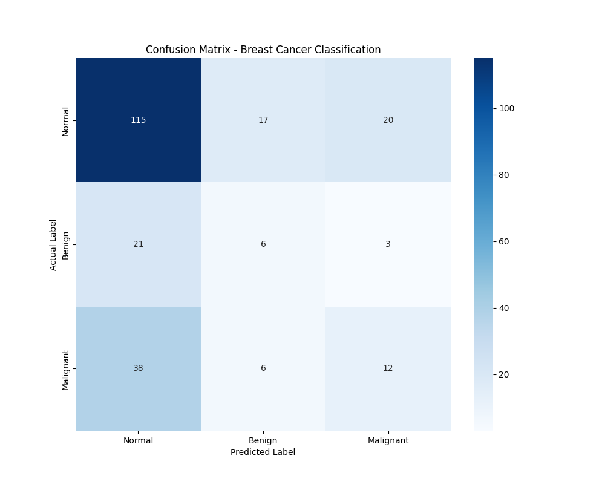

# Breast Cancer Classification Project

## 📌 Project Overview
This repository contains the code and results for the breast cancer classification project in the TDT4265 course.

## 📂 Repository Structure
\`\`\`
Classification/
├── .gitignore              # Ignore large data and cache files
├── main.py                 # Main training script
├── inference.py            # Inference/prediction script
├── split_unilateral.csv    # Data split configuration
├── predictions.csv         # Model prediction results
├── README.md               # This file
├── data/                   # Raw and processed data (not included in repo)
└── runs/                   # Model checkpoints and logs (not included in repo)
\`\`\`

## 💻 Environment & Machine Information

### Hardware
- **Server**: IKT AISPARK1
- **GPU**: NVIDIA GPU (CUDA enabled)
- **OS**: Linux (Ubuntu-based)

### Software
- **Python Version**: 3.x (Anaconda/Miniconda environment)
- **Key Libraries**:
  - PyTorch
  - NumPy
  - Pandas
  - scikit-learn
  - nibabel (for medical image processing)

### Environment Setup
You can recreate the environment using the following steps:
\`\`\`bash
# Create conda environment
conda create -n breast_cancer python=3.10
conda activate breast_cancer

# Install dependencies (example)
pip install torch torchvision numpy pandas scikit-learn nibabel
\`\`\`

## 🚀 How to Run
1.  **Training**:
    \`\`\`bash
    python main.py
    \`\`\`
2.  **Inference/Prediction**:
    \`\`\`bash
    python inference.py
    \`\`\`

## 📄 Results
- Final predictions are stored in \`predictions.csv\`.

---

## 📊 Model Evaluation Results

### 1. Validation Set Classification Report
The following metrics were obtained by running the final 50-epoch model on the validation set:

| Class      | Precision | Recall | F1-Score | Support |
|------------|-----------|--------|----------|---------|
| Normal     | 0.66      | 0.76   | 0.71     | 152     |
| Benign     | 0.21      | 0.20   | 0.20     | 30      |
| Malignant  | 0.34      | 0.21   | 0.26     | 56      |
| **Accuracy** |           |        | **0.56** | 238     |
| Macro Avg  | 0.40      | 0.39   | 0.39     | 238     |
| Weighted Avg | 0.53    | 0.56   | 0.54     | 238     |

### 2. Confusion Matrix
The confusion matrix (saved as `confusion_matrix.png`) provides a visual summary of the model's performance across all classes:

> Note: The confusion matrix image is generated by `evaluate.py` and will be displayed here once the file is pushed to the repository.
